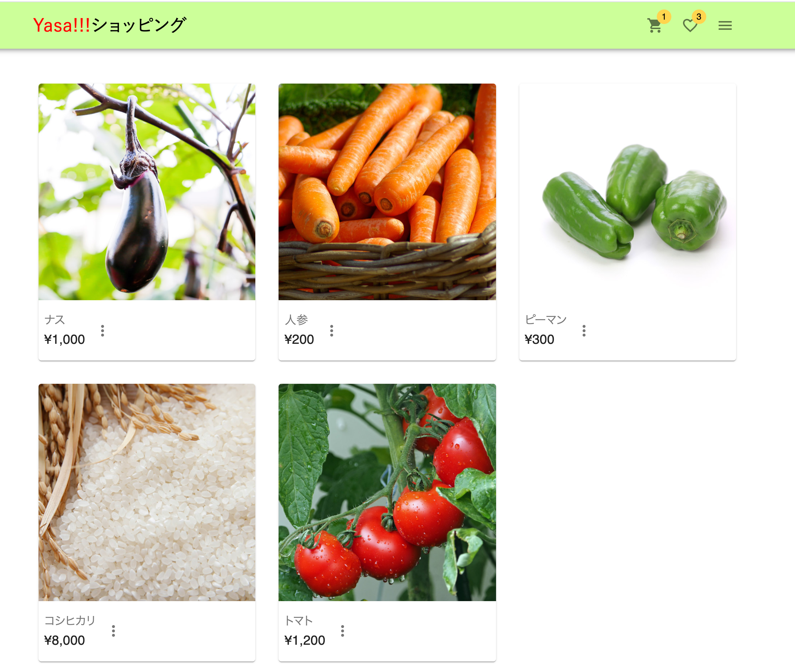

# Yasa!!!ショッピング

## 概要
野菜を中心に取り扱うECアプリです。  
ECサイトでの販売をすることで両親がつくった野菜を全国の方に届けたいという思いで作りました。

### URL
<https://ec-app-f17ae.web.app/>

### テストアカウント
メールアドレス: buyer@gmail.com  
パスワード: buyer000

## 機能一覧
・ユーザー登録、編集機能  
・ログイン、ログアウト機能  
・商品の登録、編集、削除機能  
・商品詳細表示(画像のスワイパー機能)  
・商品購入機能  
・カテゴリー機能  
・お気に入り機能  
・カート機能  
・注文履歴  

## 今後実装したい機能
・レビュー機能  
・キーワード検索機能  
・商品一覧のページネーション  
・Stripeにによる決済方法の導入  

## 使用技術
### フロントエンド
・HTML  
・CSS  
・JavaScript  
・React  
・React-Redux  
・React-router  
・React Hooks  
・React-swiper  
・Material-UI  

### インフラ・サーバーサイド・データベース
・Firebase  
・Cloud Functions  
・Firebasse Auth  
・Cloud Storage  
・Firestore  

### 開発環境
・npm  
・create-react-app  

## 制作背景
私の両親は農業を営んでいます。現在地方の農家はIT化が進んでおらず、以下のような課題があると感じたため、制作に至りました。  
【課題】  
①生産者から消費者に届くまでに時間がかかる→新鮮な状態で野菜を提供できない。  
②遠方の方にも手に取ってもらいたい。  
③中間マージンにより、生産者の手取りは少ないのに野菜の値段は高い。  
④外出自粛中でも気軽に野菜が食べられる環境を提供したい。  
これらを解決するために自社ECを制作しようと思いました。  

## License
The source code is licensed MIT. The website content is licensed CC BY 4.0,see LICENSE.

